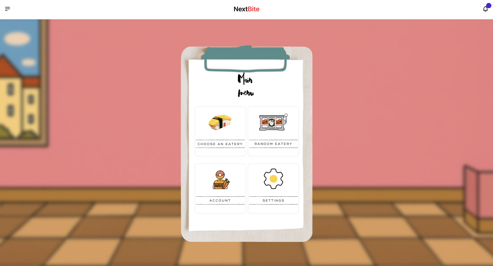

# NextBite
AI-integrated web application that finds the closest hawker center in Singapore to you based on requests in Natural Language.

**Link to project**:[Project page](https://next-bite-nu.vercel.app/menu)

## Overview
**Tech Used**
- Frontend : React (TypeScript) , HTML, CSS, TailwindCSS, DaisyUI
- Backend : Node.js, Express.js, PostgreSQL (hosted on AWS), Firebase
- AI/ML : Pytorch, Hugging Face

Created the UI/UX using React and TailwindCSS. 
The UI/UX design was created with inspiration from the hawkers in Singapore. 

Used Express.js to serve a RESTful API and handle query requests to PostgreSQL database hosted on AWS. 
Used Firebase to handle authentication and secure the application.

Created a Named Entity Recognition model fine-tuned to include Singapore food names, using Hugging Face and Pytorch.
The model is hosted on Hugging Face spaces. 

## How its made
**Main Pages of App**
* Choose an Eatery – Free-form preference entry processed with NLP
* Random Eatery – Suggestions based on behavior or at random
* Curated Showcase – Detailed cards for matched food spots
* Account – Profiles storing preferences, allergies, etc.

### Main Menu Page

The Main Menu serves as the app’s central control panel, offering clear navigation choices:
* Choose an Eatery: Leads to a page with a search query where users can input whatever they want
* Random Eatery: Provides spontaneous dining suggestions, factoring in recent user behavior and preferences. (Currently being updated due to the upscaling of data in the database)
* Account Management: Allows users to manage profile details, including allergy information, preferences, and religious restrictions. 
The Main Menu design prioritizes simplicity, accessibility, and responsiveness using React components styled with Tailwind CSS to provide a clean, modern interface suitable for multiple device sizes.
The frontend is also developed in a manner that captures users’ attention while signifying that it is an app for recommending food or restaurants, with the diner's appearance portrayed by the app itself.

### Choose an Eatery Page

A critical innovation of NextBite is the flexible preference input method. This page currently features a search query style input box where users can stack multiple preferences that they have together.
“I want seafood tonight.”
“Looking for a quiet cafe with vegan desserts.”
“Budget under $15, near Marina Bay.”
So all of these requests can be stacked in the form of “I am looking for a quiety café with seafood and vegan desserts near Marina Bay with a Budget under $15”

Upon submission, these inputs are parsed by our NLP module to extract meaningful keywords, phrases, and sentiment to query the restaurant database for matches. Currently, this module supports basic keyword extraction and phrase matching, with plans to incorporate more advanced semantic analysis. 
For example, currently this search query is able to accurately identify the food type that you’re looking for, such as “I want Indian food” or “I want Sushi”. The atmosphere and budget setting are currently being worked on and will soon be available. 

### Random Eatery Suggestion

To encourage discovery and serendipity, NextBite includes a feature offering random eatery suggestions influenced by:
* User’s historical preferences and recent searches.
* Popular eateries trending among similar user profiles.
* A purely random selection to inspire exploration.
This feature is currently still under work as with the upscaling of our data, we are trying to match user preferences with the other data that we have, and will be soon available too.

### Account Management

Implemented using Firebase Authentication, the Account module supports:
* Secure user registration and login with email/password.
* Profile customization including allergy and dietary restriction management.
* Persistent user settings that influence all recommendations, automatically filtering out incompatible eateries.
User data is encrypted and securely stored, leveraging Firebase’s backend infrastructure to ensure reliability and privacy.
Each account allows the user to provide a series of information when they first apply for an account.

This information would then be securely stored in Firestore Firebase to ensure that this sensitive user data is protected. This information is also being integrated into our Random Eatery Page, such that we are able to recommend restaurants to users that follow their food preferences and also avoid their allergies and any dietary restrictions they may have. 

### Curated Restaurants Showcase Page
This page displays a curated list of eateries matching user preferences. Each listing features:
The restaurant’s name and location.
Current promotional deals or discounts.
Key selling points or specialties relevant to the user’s criteria.
Navigation buttons to browse through suggestions.
Clicking on an eatery brings up detailed information, including:
Complete menu with prices.
Contact information and reservation links, where applicable.
User reviews (planned for Milestone 3).
The UI for this page was designed to prioritize clarity and usability, allowing users to make informed dining choices quickly.

For example, when one searches, I want to eat western in the search query, we are able to decipher the food in this search query and then match it to our database. 

This is the small sample database we are using currently that incorporates a few restaurants to get the basic functionality of the app going. 

Now, from this database, it is evident that for Western restaurants, we have Swensen’s Collins and PS Café, highlighted. Now in my search query image, I have selected that I want restaurants that would match my preference, but are also ranked starting from the ones closest to me. Given that my current location is closer to the latitude and longitude of Collin’s as compared to Swenses and PS Café, I have 

## Technical Architecture
Our frontend is developed using React.js, a powerful JavaScript library renowned for its component-based architecture. This architecture promotes modularity, making it easier to maintain, scale, and reuse code across various parts of the application. React's virtual DOM and state management features allow us to build dynamic and interactive user interfaces that respond efficiently to user input.
For styling, we’ve integrated Tailwind CSS, a utility-first CSS framework that enables rapid development without the need for writing custom CSS from scratch. Tailwind’s predefined utility classes help maintain a consistent design system while accelerating the development process. It also ensures our UI remains highly responsive across a wide range of screen sizes, making the application mobile-friendly and adaptable to modern design standards.
To manage client-side routing, we’ve implemented React Router, which enables smooth and intuitive navigation throughout the application. React Router allows for the creation of nested routes and dynamic parameters, supporting a true single-page application (SPA) experience. This ensures that user sessions remain uninterrupted and transitions between pages feel seamless, enhancing the overall usability of the platform.
Together, this combination of React, Tailwind CSS, and React Router forms a robust frontend stack that allows for a high-performance, responsive, and maintainable user interface—laying a strong foundation for the rest of our system.
Our backend architecture adopts a hybrid approach that leverages both Firebase Firestore and PostgreSQL to optimize for scalability, flexibility, and structured data management. Firebase Firestore, a NoSQL cloud database offered by Google, is primarily used to handle user-related data, including account information, food preferences, dietary restrictions, and other personalized user inputs. Firestore’s real-time synchronization capabilities allow us to instantly reflect user changes across the app, enabling a highly responsive and personalized user experience. Its document-based storage structure provides the flexibility needed to accommodate diverse and dynamic user data without the constraints of rigid schema definitions. Furthermore, Firebase’s seamless integration with our authentication layer ensures that user identity and data are tightly coupled and securely managed.
On the other hand, PostgreSQL serves as the backbone for managing our structured restaurant-related data. As a powerful and reliable relational database, PostgreSQL allows us to enforce data integrity through schemas, foreign key relationships, and advanced query capabilities. This is especially critical when dealing with large-scale, interrelated datasets such as restaurant details, pricing structures, location metadata, deal tracking, and aggregated reviews. PostgreSQL’s support for complex joins and indexing significantly enhances the performance of our recommendation and search features, particularly when filtering restaurants based on multiple criteria.
By strategically combining Firestore and PostgreSQL, our backend achieves the best of both worlds—real-time, flexible handling of user-specific data via Firestore, and robust, structured storage of restaurant information using PostgreSQL. This dual-database architecture enables us to deliver a seamless, scalable, and efficient experience to users, while maintaining strong backend reliability and performance.

## Natural Language Processing Module

Natural Language Processing is at the heart of NextBite's innovation. The app employs transformer-based models (particularly BERT from Hugging Face) to convert user-entered sentences into semantic vectors. These vectors represent the deeper meaning behind the input, allowing us to move beyond simple keyword matching. For instance, phrases like "a place with crispy food that's not too spicy" are parsed for texture, flavor, and negation—all of which are tokenized, embedded, and matched against pre-processed review data.
Our semantic pipeline supports both sentence-level classification and phrase-level entity recognition. This dual-layered approach allows us to extract user intent (e.g., desire for ambiance, dietary need, food type) while also preserving specific constraints (e.g., distance, pricing, crowd levels). Matching is performed using cosine similarity on high-dimensional vectors, ensuring that the restaurants recommended are not just relevant but aligned with both stated and inferred preferences.

Our system supports natural language input across various levels of complexity. Users can input simple keywords or full sentences like "I want spicy ramen near Serangoon that's under $10." Our NLP engine translates this into a multi-dimensional query. 
Restaurants are displayed based on match confidence, calculated from semantic similarity scores and spatial relevance. Matched tags, cuisine highlights, and contextual notes (e.g., "Matched for: spicy, under $10, ramen") are shown. The list is dynamically updated and interactive.

Currently, there are further improvements being carried out to the model such that identifications of adjectives tied to food can be observed and then categorized. For example, if the user were to ask for soft noodles, a more intricate analysis of the Database can take place, such that the restaurant recommendations given to the user are further curated. 
As for budget tracking, this is also tied to analysis of reviews and the offering of the menu by the restaurant page, after which we are able to make a decision as to whether the meals would fit within the budget. 

## Backend and Database

We employ PostgreSQL as our primary database to store restaurant data. This choice allows complex queries involving filtering by multiple attributes, joins, and sorting by relevance or rating. Our schema includes a table that currently takes in: 
Restaurant name
Address
Cuisine_type
Specialty meals
Latitude and Longitude of the restaurant
A mini-database with sample entries has been seeded to validate feature development and test query responses.

